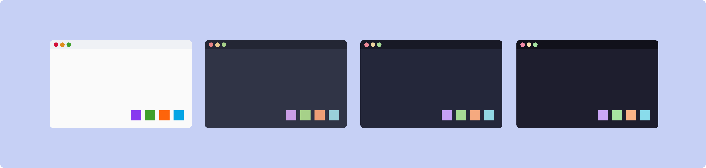

# Catppuccin Bootstrap Theme



- 🌻 **Latte**: Our lightest theme harmoniously inverting the essence of
  Catppuccin's dark themes.
- 🪴 **Frappé**: A less vibrant alternative using subdued colors for a
  muted aesthetic.
- 🌺 **Macchiato**: Medium contrast with gentle colors creating a
  soothing atmosphere.
- 🌿 **Mocha**: The Original — Our darkest variant offering a cozy feeling
  with color-rich accents.

## How to check

1. need quarto
2. git clone repo
3. change in `_quarto.yml`:

```yaml
format:
  html:
    theme: sass/mocha.scss
```

**Mocha (default)**

## To Do

![[catppuccin-bootswatch-theme/TODO]]
